

## Dental clinic management system

A web application for a dental clinic that provides efficient clinic management and improves the quality of patient care.

## Technology stack

- PHP 8.2
- Laravel 10.4
- MySQL
- Tailwind CSS

## Features

🧑 Patient

- Register and log in
- Access personal dashboard
- Book appointments with dentists
- View appointment history
- View invoices and payment history

🧾 Receptionist

- Log in to the system
- Manage appointments for all patients
- Manage patient profiles
- Handle invoices and payments

🦷 Dentist

- Log in to the system
- Set and update personal work schedule
- View assigned appointments
- Manage treatment details
- Issue invoices for completed treatments

🛠️ Super admin

- Full access to all system modules
- Manage appointments
- Manage receptionists and dentists
- Manage clinic services
- Monitor overall system activity

## Screenshots

#### Home page
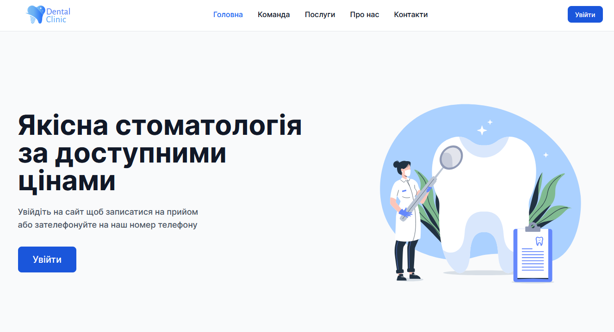

#### Registration page
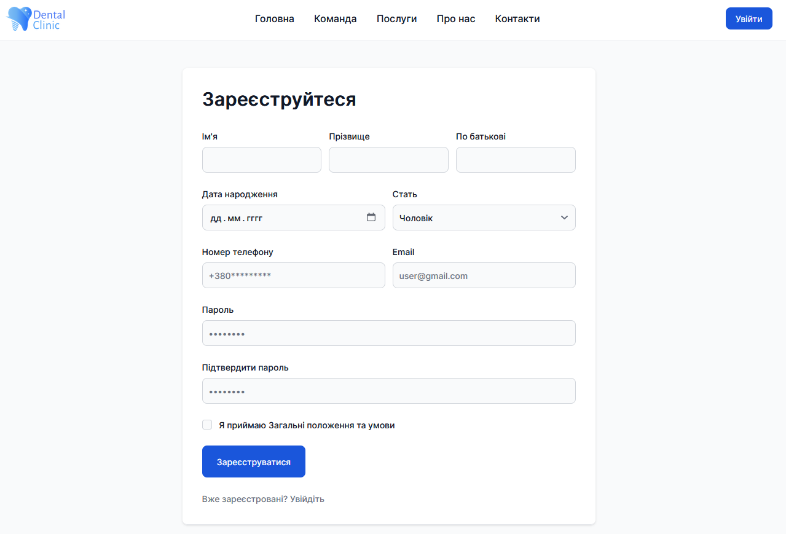

#### Patient pages
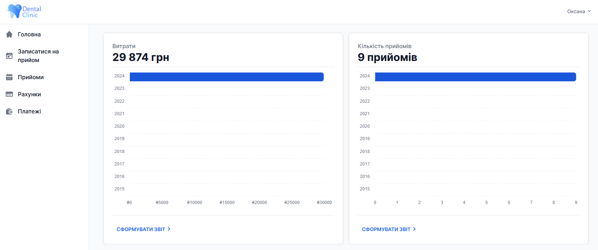
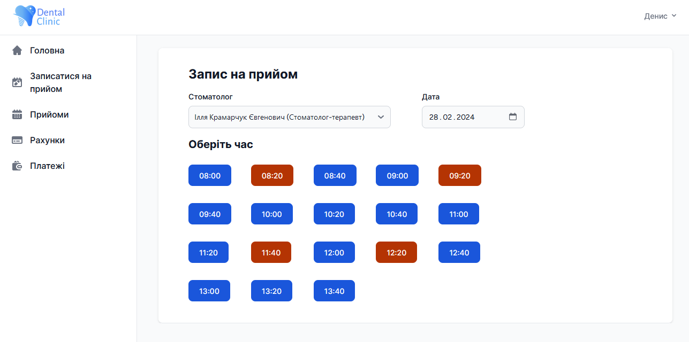
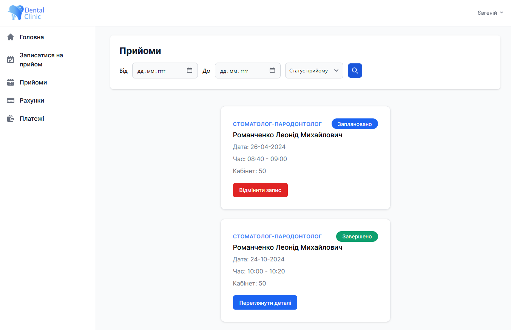
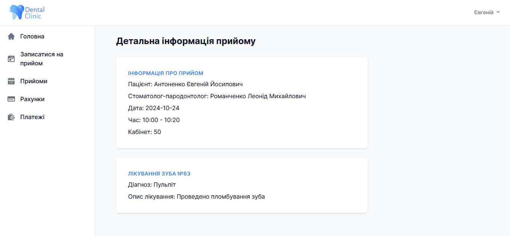

#### Dentist pages
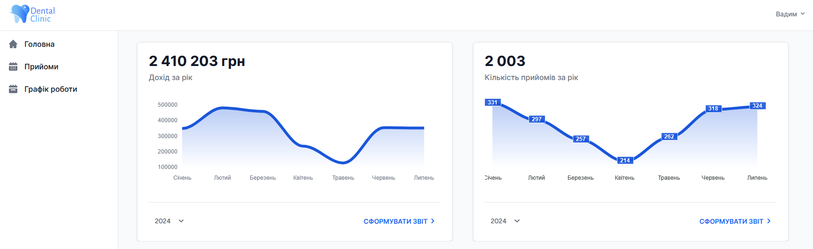
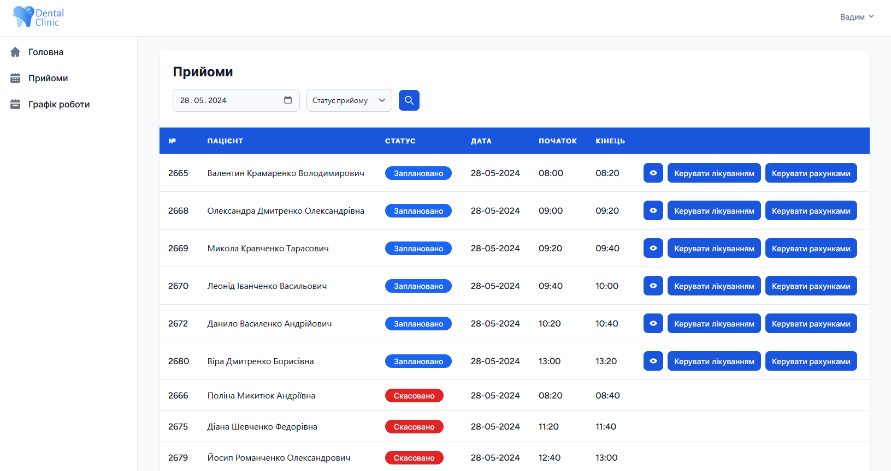
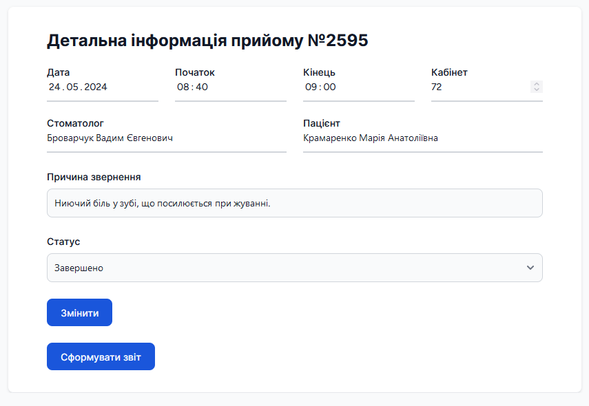
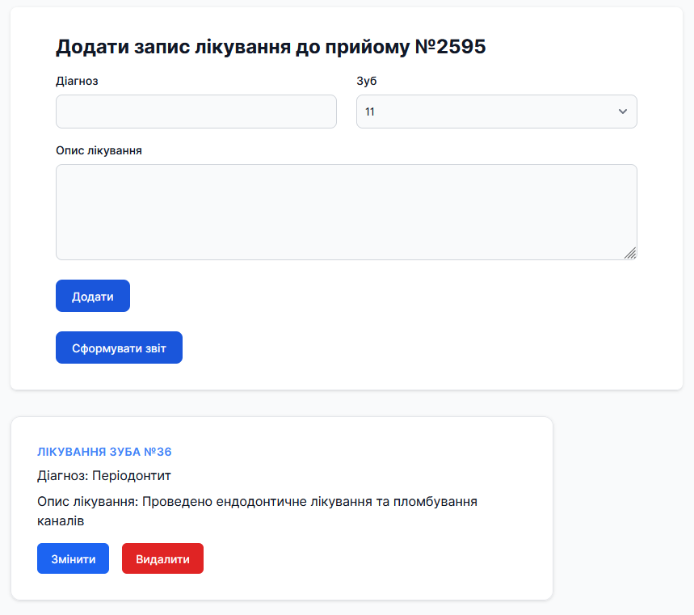

#### Receptionist pages

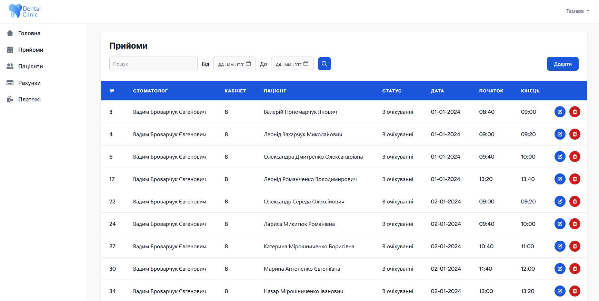

#### Super admin pages
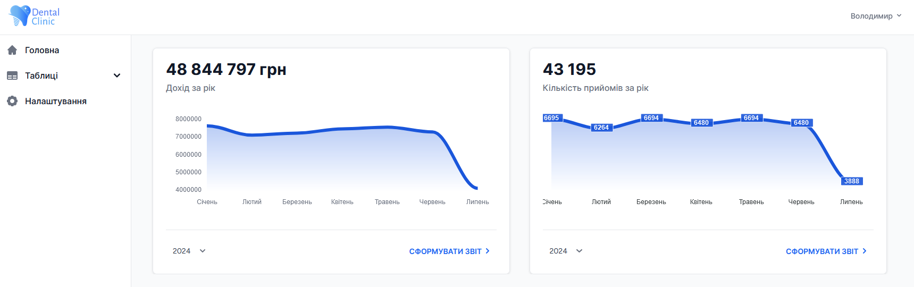
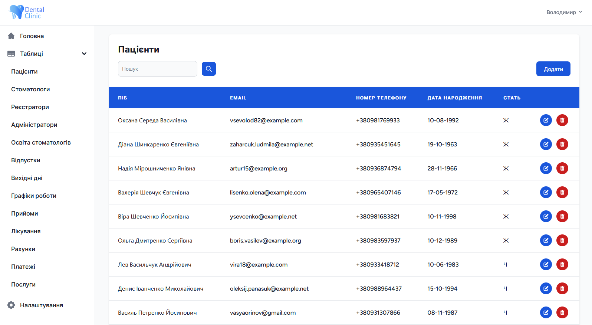

## License

The Laravel framework is open-sourced software licensed under the [MIT license](https://opensource.org/licenses/MIT).
